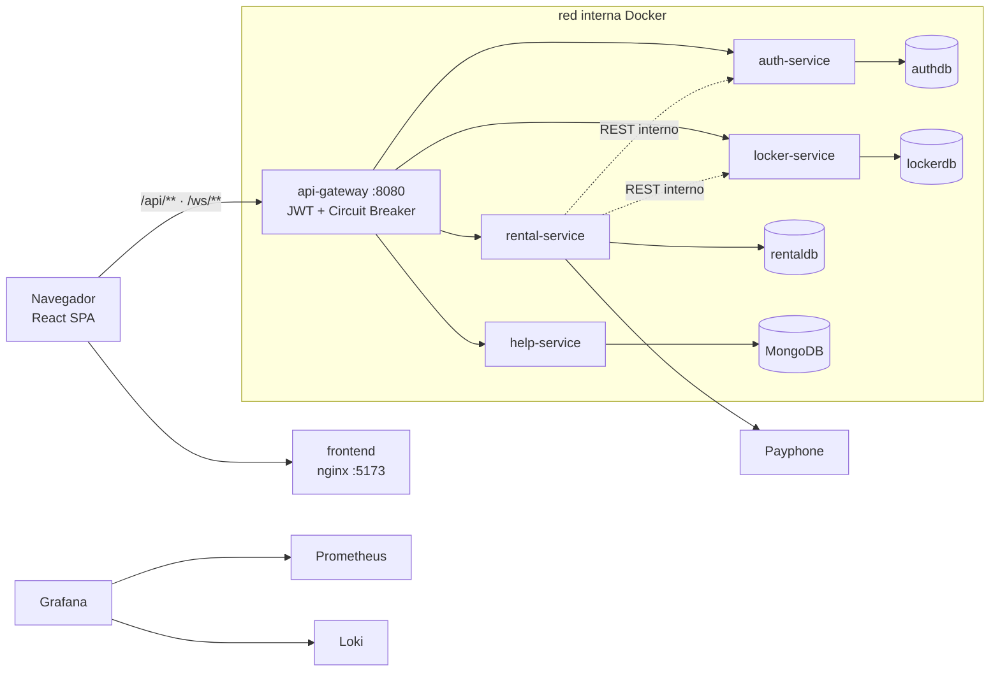

# AEIS — Sistema de Alquiler de Casilleros (Microservicios)

[](https://github.com/Gabo0526/adv-web-apps-aeis-app/actions/workflows/ci.yml)
[](https://github.com/Gabo0526/adv-web-apps-aeis-app/actions/workflows/cd.yml)

Sistema web para que los estudiantes de la EPN renten casilleros de la AEIS: reserva en línea, **pago real con Payphone**, administración de períodos/bloques/rentas con exportación a Excel, y un módulo de soporte con **chat en tiempo real** (WebSocket). Es la migración completa de un monolito Spring Boot + Thymeleaf a una arquitectura de **microservicios** — proyecto final de Aplicaciones Web Avanzadas (2026-A).



## Lo esencial

| | |
|---|---|
| **Arquitectura** | 4 microservicios Spring Boot 3.5 (Java 17) + Spring Cloud Gateway, database-per-service (3× MySQL + MongoDB), frontend React 18 + Vite servido por nginx |
| **Patrones** | **API Gateway** (enrutamiento, JWT, CORS) y **Circuit Breaker** (Resilience4j en el gateway y en las llamadas internas) |
| **Seguridad** | JWT HS256 emitido por auth-service y validado en el gateway; BCrypt; verificación de cuenta y reseteo de clave por email; anti-spoofing de headers; WebSocket autenticado y autorizado por frame |
| **Monitoreo** | Prometheus + Grafana (dashboard aprovisionado) + Loki/Promtail para logs — todo declarativo |
| **CI/CD** | GitHub Actions: build + tests de los 6 componentes en cada push; imágenes Docker publicadas a GHCR en cada merge a `main` |

## Documentación

| Documento | Contenido |
|---|---|
| [docs/ARQUITECTURA.md](docs/ARQUITECTURA.md) | Comparativo monolito vs. microservicios, refactor del backend y de las BDs, patrones, seguridad en detalle, flujo de pago, monitoreo, CI/CD y decisiones descartadas |
| [docs/API.md](docs/API.md) | Referencia completa de endpoints (públicos, admin, internos y WebSocket) con ejemplos |
| [docs/DEMO.md](docs/DEMO.md) | Guion de la demostración con tiempos, checklist previo y plan B |
| [docs/DESARROLLO.md](docs/DESARROLLO.md) | Correr servicios fuera de Docker, tests, convenciones, secretos, datos de demo |
| [PLAN.md](PLAN.md) | Especificación original con la que se construyó el sistema (11 fases) |

## Arranque desde cero

Requisitos: Docker + Docker Compose. (Java 17/Maven/Node 20 solo para desarrollo fuera de Docker.)

```bash
cp .env.example .env   # completar secretos: JWT, BDs, SMTP, Payphone
```

```bash
docker compose up -d --build
```

```bash
docker compose ps      # esperar a que todo quede healthy (~1 min)
```

Entrar a **http://localhost:5173** — usuario admin sembrado: `admin` / `ADMIN_DEFAULT_PASSWORD` del `.env`. Para datos de demo (período activo, bloques), ver [docs/DESARROLLO.md](docs/DESARROLLO.md#datos-de-demo).

> `docker compose down` detiene todo conservando datos; `down -v` además **borra los volúmenes**.

## URLs del sistema

| Servicio | URL | Notas |
|---|---|---|
| Frontend | http://localhost:5173 | React servido por nginx |
| API Gateway | http://localhost:8080 | REST `/api/**` · WebSocket `/ws` |
| Grafana | http://localhost:3000 | credenciales `GRAFANA_*` del `.env` |
| Prometheus | http://localhost:9090 | targets: los 5 servicios |

Los microservicios (8081–8084) **no publican puertos al host** — solo se llega a ellos por el gateway. Las BDs publican puertos únicamente como facilidad de desarrollo ([detalle](docs/DESARROLLO.md#correr-un-servicio-backend-fuera-de-docker)).

## Imágenes publicadas (GHCR)

Cada push a `main` publica las 6 imágenes con tags `latest` y el SHA del commit:

```
ghcr.io/gabo0526/adv-web-apps-aeis-app-{api-gateway,auth-service,locker-service,rental-service,help-service,frontend}
```

## Estructura del repositorio

```
adv-web-apps-aeis-app/
├── .github/workflows/      # ci.yml (build+tests) · cd.yml (imágenes a GHCR)
├── backend/
│   ├── api-gateway/         # enrutamiento, JWT, CORS, circuit breaker
│   ├── auth-service/        # usuarios, registro/verificación, login JWT, reset de clave
│   ├── locker-service/      # bloques y casilleros, estados, endpoints internos
│   ├── rental-service/      # períodos, rentas, Payphone, Excel, schedulers
│   └── help-service/        # tickets de soporte + chat STOMP (MongoDB)
├── frontend/                # React + Vite (nginx en producción)
├── monitoring/              # Prometheus, Grafana (provisioning), Loki, Promtail
├── docs/                    # arquitectura, API, demo, desarrollo
├── docker-compose.yml       # 14 contenedores, red única, healthchecks
└── .env.example             # plantilla de configuración (el .env real nunca se commitea)
```

## Origen

Migración del monolito de referencia `webapp-aeis` (Spring Boot + Thymeleaf + MySQL única). El análisis del corte por dominios y las decisiones de arquitectura están documentados en [docs/ARQUITECTURA.md](docs/ARQUITECTURA.md); la especificación fase a fase, en [PLAN.md](PLAN.md).
