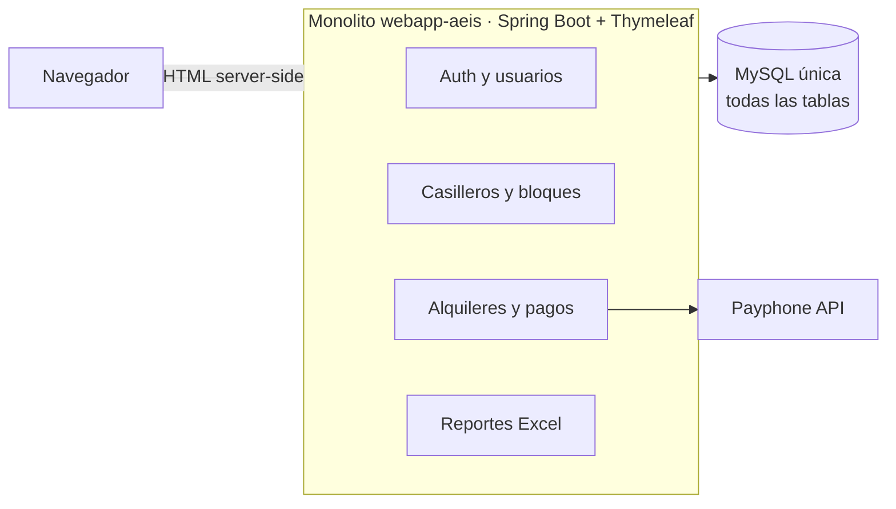
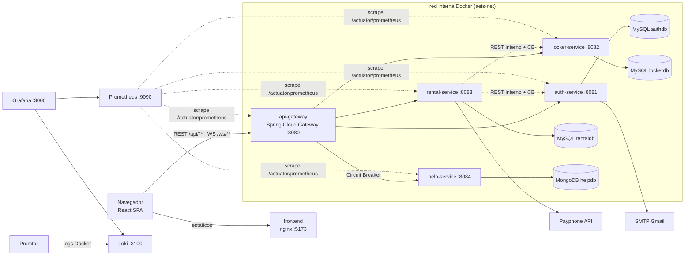
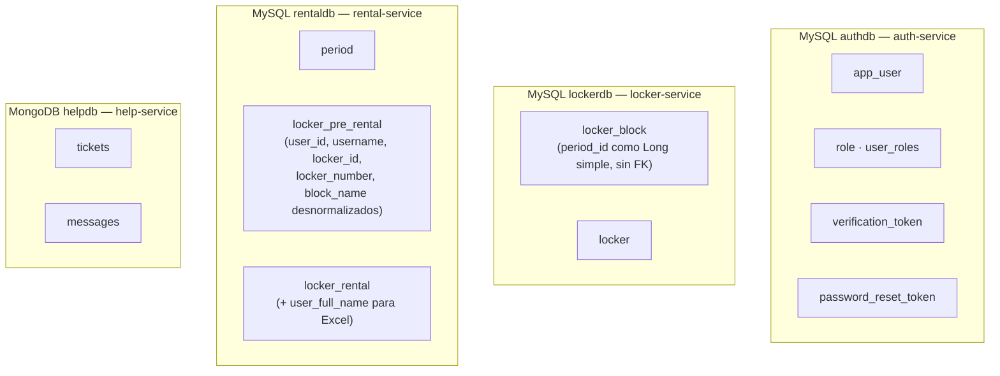
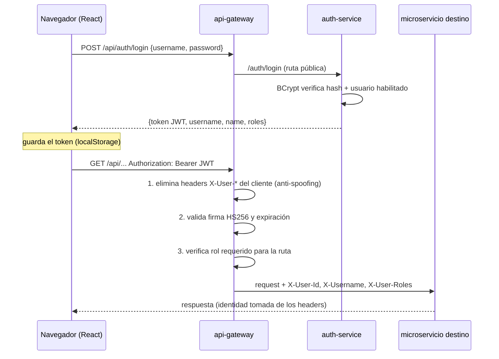
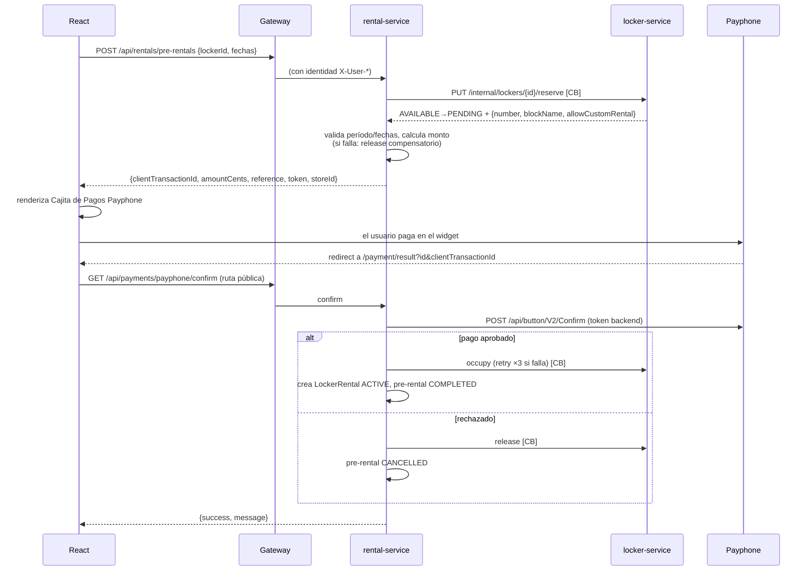

# Arquitectura del sistema

Sistema de alquiler de casilleros de la AEIS (EPN), migrado de un monolito Spring Boot a una arquitectura de microservicios. Este documento explica **qué se construyó y por qué**, con el nivel de detalle que exige la rúbrica del proyecto: comparativo de arquitecturas, refactorización del backend y de las bases de datos, patrones de microservicios, seguridad, monitoreo y CI/CD.

## 1. De monolito a microservicios

### 1.1 Arquitectura anterior (monolito)

Una sola aplicación Spring Boot 3.5 (Java 17) concentraba todo: autenticación con sesiones de servidor, gestión de casilleros, alquileres con pagos Payphone, reportería Excel y las vistas (Thymeleaf, renderizado en servidor), contra **una única base de datos MySQL**.

Limitaciones que motivaron la migración: un solo despliegue para todo (cualquier cambio implica redesplegar el sistema completo), imposibilidad de escalar módulos por separado, una falla en un módulo puede tumbar la aplicación entera, y un frontend acoplado al servidor que mezclaba controladores MVC con endpoints REST.

### 1.2 Arquitectura nueva (microservicios)

Cada microservicio es un proyecto Maven independiente con su propia base de datos, su propia imagen Docker y su propio ciclo de build/test en CI. Los servicios internos **no publican puertos al host**: solo el gateway (8080) y el frontend (5173) son accesibles desde fuera de la red Docker.

### 1.3 Cómo se refactorizó el código del backend

El monolito estaba bien estratificado (controller / service / repository), lo que permitió **cortar por dominios** en lugar de reescribir:

| Dominio del monolito | Destino | Qué cambió en el corte |
|---|---|---|
| `UserService`, `EmailService`, entidades `User`/`Role`/`VerificationToken` | **auth-service** | Se eliminó el form-login de sesiones y se reemplazó por emisión de JWT; se agregó el flujo de reseteo de contraseña (no existía) |
| `LockerService`, `LockerBlockService`, entidades `Locker`/`LockerBlock` | **locker-service** | La FK a `Period` se convirtió en columna simple `periodId`; se agregaron endpoints internos `reserve/occupy/release` para que otros servicios muten estados de casillero de forma controlada |
| `PeriodService`, `LockerRentalService`, `LockerPreRentalService`, `PayPhoneService`, `ExcelExportService`, schedulers | **rental-service** | Las FKs a `User` y `Locker` se desnormalizaron (ver §2); las mutaciones directas de casilleros se reemplazaron por llamadas REST internas con Circuit Breaker |
| Vistas Thymeleaf (16 templates) | **frontend React** | Desaparecen los controladores MVC; el frontend consume solo APIs REST vía gateway |
| — (no existía) | **help-service** | Módulo nuevo de soporte: tickets + chat en tiempo real (WebSocket/STOMP) sobre MongoDB |

Los controladores REST que ya existían en el monolito (`controller/api/**`) fueron el punto de partida de las APIs nuevas; los controladores Thymeleaf se convirtieron en endpoints REST (p. ej. el flujo de renta `POST /user/lockers/rent/{id}` pasó a ser `POST /rentals/pre-rentals` + páginas React).

## 2. Refactorización de la base de datos (database per service)

La BD única del monolito se separó en **cuatro bases independientes**, una por servicio. Ningún servicio puede leer las tablas de otro; toda colaboración pasa por APIs.

Las dos decisiones clave del refactor:

1. **Referencias cruzadas por ID, sin FK**: `locker_block.period_id` es un `Long` plano (Period vive en rental-service). La integridad referencial entre servicios se garantiza a nivel de aplicación, no de base de datos — es el costo estándar de la autonomía de datos en microservicios.
2. **Desnormalización con snapshot**: cuando se crea un pre-alquiler, rental-service guarda una copia de los datos que necesita del usuario y del casillero (`username`, `lockerNumber`, `blockName`, `userFullName`). Así los listados de administración y la exportación a Excel **no hacen llamadas en cascada** a otros servicios (evita el problema N+1 distribuido), y el histórico de rentas conserva los datos tal como eran al momento de la renta.
3. **Persistencia políglota**: help-service usa MongoDB porque los mensajes de chat encajan naturalmente en documentos (escritura intensiva, sin joins); cada servicio elige el motor que mejor le calza.

## 3. Patrones de microservicios implementados

### 3.1 API Gateway (Spring Cloud Gateway)

Punto de entrada único del sistema (`:8080`). Responsabilidades:

- **Enrutamiento**: `/api/auth/**` y `/api/users/**` → auth-service; `/api/lockers|locker-blocks/**` → locker-service; `/api/periods|rentals|excel|payments/**` → rental-service; `/api/help/**` y `/ws/**` → help-service. Reescribe `/api/X` → `/X`.
- **Validación de JWT centralizada** (ver §4): los microservicios no re-validan tokens; confían en los headers que inyecta el gateway dentro de la red interna.
- **Autorización gruesa por rol**: mapa (método, patrón) → rol requerido; p. ej. `/api/users/**` y las escrituras sobre `/api/periods/**`, `/api/lockers/**` exigen `ADMIN`.
- **CORS** para el origen del frontend.
- Los endpoints internos (`/internal/**`) **no tienen ruta en el gateway**: son inalcanzables desde fuera de la red Docker.

### 3.2 Circuit Breaker (Resilience4j) — en dos lugares

**a) En el gateway** (filtro `CircuitBreaker` sobre la ruta de help-service): si help-service no responde, el gateway corta el circuito y responde `503 {"error": "El módulo de ayuda no está disponible..."}` desde un fallback local en vez de dejar colgado al cliente. Demostrable en vivo con `docker stop aeis-help-service-1`.

**b) En rental-service** (anotaciones `@CircuitBreaker` sobre los clientes REST internos hacia locker-service y auth-service): si un servicio dependiente cae, tras superar el umbral de fallos el circuito se abre y las llamadas fallan rápido con `503 "Servicio de casilleros no disponible, intenta más tarde"` en lugar de agotar threads esperando timeouts.

Configuración (en `application.properties`, idéntica para ambos clientes):

| Parámetro | Valor | Significado |
|---|---|---|
| `sliding-window-size` | 10 | Evalúa las últimas 10 llamadas |
| `minimum-number-of-calls` | 5 | No abre el circuito con menos de 5 muestras |
| `failure-rate-threshold` | 50% | Se abre si la mitad falla |
| `wait-duration-in-open-state` | 10s | Tiempo en abierto antes de probar de nuevo |
| `permitted-number-of-calls-in-half-open-state` | 3 | Llamadas de prueba en estado semiabierto |
| `ignore-exceptions` | excepciones de negocio | **Los 409/404 de negocio (casillero ocupado, no encontrado) NO cuentan como fallos**: solo los errores de infraestructura abren el circuito. Sin esto, varios usuarios intentando reservar casilleros ocupados podrían bloquear todas las rentas |

## 4. Seguridad

### 4.1 Autenticación con JWT (HS256)

- Token firmado con **HMAC-SHA256** y secreto compartido (`JWT_SECRET`, inyectado por entorno; nunca en el código). Claims: `sub` (username), `uid` (cédula), `name`, `roles`. Expiración: 8 horas.
- **Anti-spoofing**: el gateway elimina cualquier header `X-User-*` que venga del exterior antes de inyectar los propios. Un cliente no puede hacerse pasar por otro usuario ni por admin inyectando headers.
- Los microservicios son **stateless** (sin sesiones): la única fuente de identidad son los headers del gateway, válidos solo dentro de la red Docker.

### 4.2 Otras medidas

| Medida | Dónde |
|---|---|
| Contraseñas con **BCrypt** (hash + salt) | auth-service |
| Verificación de cuenta por email (token de un solo uso, expira en 24h) | auth-service |
| Reseteo de contraseña con token de un solo uso (expira en 1h) y **respuesta anti-enumeración** (200 idéntico exista o no el email) | auth-service |
| Rutas admin protegidas en el gateway **y** ProtectedRoute/AdminRoute en React (defensa en ambas capas) | gateway + frontend |
| Endpoints internos `/internal/**` sin ruta pública | gateway |
| Servicios y BDs sin puertos publicados al host (BDs solo en dev) | docker-compose |
| Secretos solo por variables de entorno (`.env` fuera del repo; `.env.example` como plantilla) | todo el stack |
| Interceptor 401 en el frontend: token inválido/expirado → logout y redirección a login | React (axios) |

### 4.3 Seguridad del WebSocket (chat de ayuda)

El chat exige **dos niveles** de control:

1. **Handshake**: el navegador no permite headers en la conexión WS, así que el JWT viaja como query param (`ws://.../ws?token=`). El gateway lo valida, y help-service lo decodifica de nuevo en un `HandshakeInterceptor` para guardar `username`/`role` en la sesión WS. **La identidad del remitente sale del token, jamás del payload del mensaje.**
2. **Por frame (`ChannelInterceptor` entrante)**: `SEND` solo se acepta hacia destinos `/app/**` (el broker simple retransmitiría frames enviados directo a `/topic/**`, permitiendo inyectar mensajes forjados), y `SUBSCRIBE` a `/topic/tickets/{id}` solo se permite al dueño del ticket o a un admin (sin esto, cualquier usuario autenticado podría leer chats ajenos en tiempo real). Además el servicio valida que quien escribe en un ticket sea su dueño o admin, y que el ticket esté abierto.

## 5. Flujo de negocio principal: renta con pago Payphone

Detalles de robustez: el pre-alquiler **expira a los 10 minutos** si no se paga; un scheduler (cada 60s) marca los vencidos como EXPIRED y libera el casillero. Otro scheduler cierra rentas cuya fecha de fin ya pasó (COMPLETED + release). Si `occupy` falla después de un pago confirmado, se reintenta 3 veces y se registra en ERROR (compensación simple y explícita; se descartó un Saga formal por complejidad innecesaria a esta escala). Tarifas: $6.50 por período académico completo, $1.00/día en renta personalizada (máx. 15 días, solo en bloques que la permiten).

## 6. Monitoreo y logs

- **Métricas**: cada servicio expone `/actuator/prometheus` (Micrometer). **Prometheus** scrapea los 5 servicios cada 15s. **Grafana** se aprovisiona declarativamente (datasources + dashboard comunitario *Spring Boot 3.x Statistics*, ID 19004) — cero configuración manual: `docker compose up` deja el dashboard funcionando.
- **Logs**: **Promtail** descubre los contenedores vía el socket de Docker (`docker_sd_configs`, montado read-only) y envía los logs a **Loki**, consultables desde la misma Grafana (Explore, p. ej. `{container="aeis-rental-service-1"}`). Métricas y logs en un solo lugar.

## 7. CI/CD (GitHub Actions)

- **`ci.yml`** (cada push/PR): matrix de 5 jobs backend (Temurin 17 + caché Maven + `mvn -B verify`, tests con H2) + job frontend (Node 20: `npm ci`, `lint`, `build`). 
- **`cd.yml`** (cada push a `main`): build y push de las **6 imágenes Docker** a GitHub Container Registry con tags `latest` y el SHA del commit (`permissions: packages: write`).
- El pipeline garantiza que lo publicado en GHCR siempre corresponde a código que compiló y pasó los tests.

## 8. Decisiones descartadas (y por qué)

| Opción | Motivo del descarte |
|---|---|
| Saga / Event Sourcing | Requieren broker de mensajería; la compensación explícita del flujo de pago cubre el caso real con una fracción de la complejidad |
| Service Discovery (Eureka) | El DNS interno de Docker Compose ya resuelve servicios por nombre; Eureka agregaría un contenedor sin beneficio a esta escala |
| ELK para logs | Elasticsearch pesa más que todo el sistema junto; Loki cubre la necesidad integrado a Grafana |
| Kubernetes | Opcional en la rúbrica; docker-compose cubre el despliegue local exigido |
| Payment-service separado | El pago es parte del flujo de renta; separarlo forzaba coordinación distribuida (terreno Saga) sin ganancia funcional |
